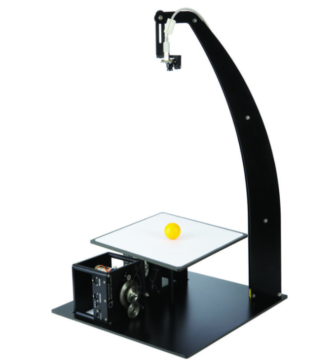
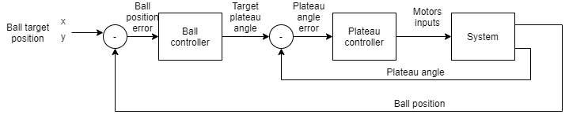

# Deep reinforcement learning for ball balancer control
##### Table of Contents

[Objective](#Objective)  
[Technologies used](#Technologies used) 
[Control architecture](#Control architecture) 

## Objective

The goal of this project is to create a DDPG agent able to control a ball balancer in order to move the ball with the desired trajectory.

## Technologies used

* DDPG (deep deterministic policy gradient)
    * Ball to plateau angle controller
    
* OpenAi gym
    * Environement / System simulation
    
* Genetic optimisation
    * Motor position controller
  
* SGD feed forward neural network regression
  * Motor and ball simulation
  
* Neural networks
  * Pytorch
  
## Control architecture

Here is the heigh level control loop.

Given this choice of architecture, the project can be devided in the main parts :
* Plateau control and simulation [Dedicated page](/https://github.com/BenInTheBox/DRL-AI-Robotics/tree/main/python_code/src/motor_simulation)
* Ball control and simualtion [Dedicated page](/https://github.com/BenInTheBox/DRL-AI-Robotics/tree/main/python_code/src/ball_simulation)

A simulation is needed for every component of the system because the controllers training need that.

The plateau controller is a ffw neural network trained thanks to a genetic optimisation. 
The ball controller is also a ffw neural network, but this time trained with DDPG.

Detailed in its dedicated page.