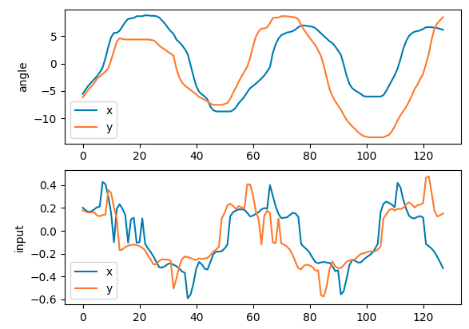
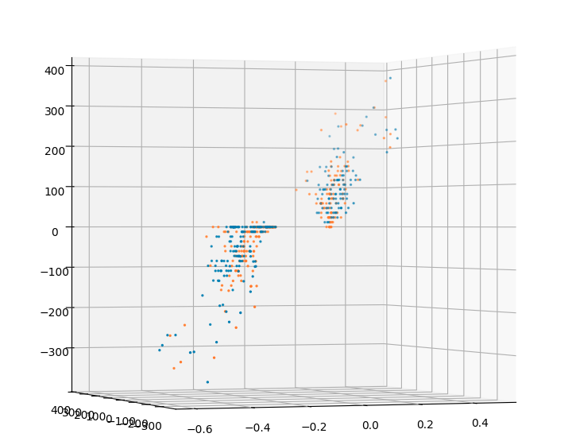
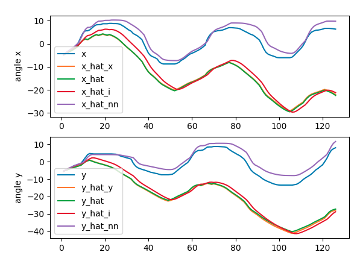
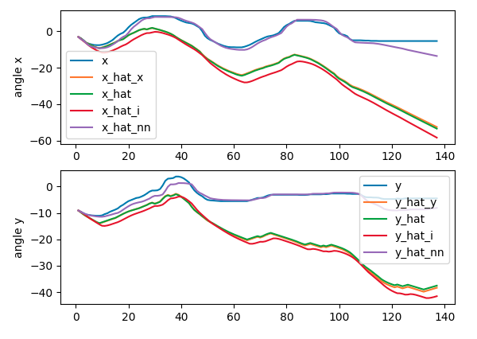
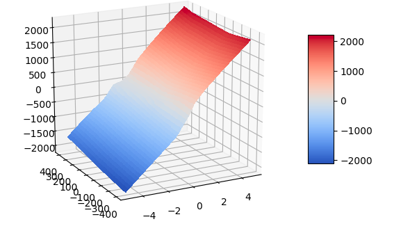
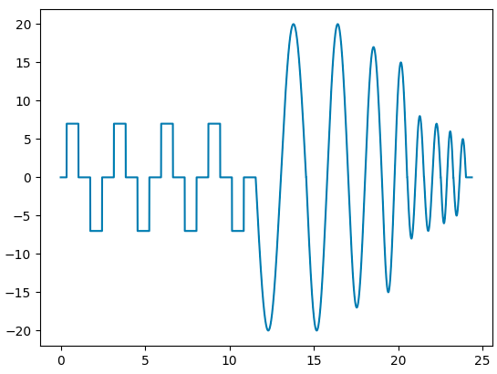
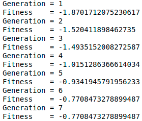
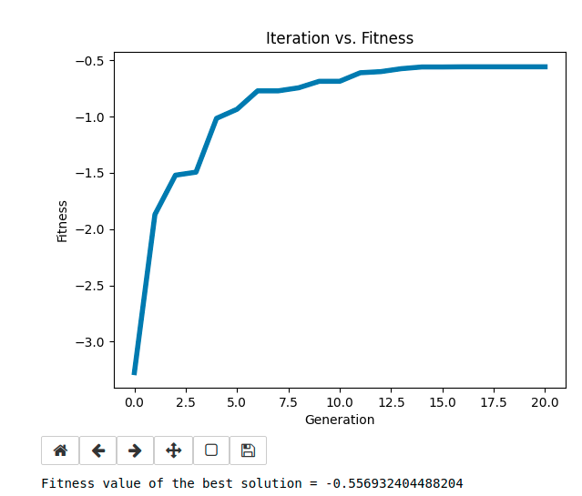
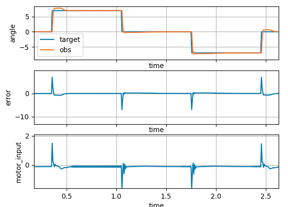
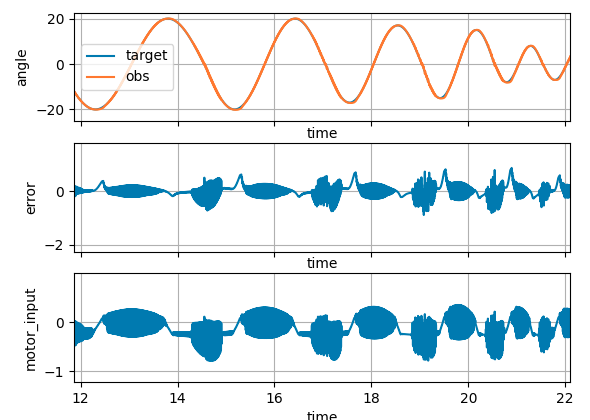

# Motor simulation and control
##### Table of Contents

[Simulation](#Simulation)  
[Control](#Control)

## Simulation

The goal of this project is to create a DDPG agent able to control a ball balancer in order to move the ball with the desired trajectory.
To do so, real system data was recorded.

For each timestep, and each motor, the position and input were recorded

Speed resulting from previous speed and input

The goal is now to create a simualtion of the system. To do so, we'll create a model of the motor that recieve the motor inputs and compute the average speed to the next timestep.

x_t+1 = x_t + s_t * dt 
s_t = f(state, inout)

### Physical model

The speed equation of a DC motor is: n_t = (V_m - R_m * I_a_t) / k_b / W_b 
It can be rewritten as A*x + B = y, and solved with least squares.

Since the inertia of the motor is ignored with the previous model. A other model is proposed, including an inertia term.

n_t+1 = (V_m - R_m * I_a_t) / k_b / W_b + I_m * n_t 
It can also be rewritten as A*x + B = y, and solved with least squares.

### Neural network model

As it is possible to see on the 3D plot of the motor, the topology is non-linear. For exemple, with near-zero input, the motor is stuck by friction. Or with inputs with an opposite sign of the velocity, ... The physical model is thus inaccurate, just a linar regression of a non-linear behavior.
The proposed solution is to fit multiples neural networks on the datas.

x_t+1 = x_t + s_t * dt 
s_t+1 = f(s_t, u_t)

Pytorch has been used, with a momentum SGD optimisation.

|            | Layer 0 | Layer 1 | Layer 2 | Layer 3 | R2-score |
|------------|---------|---------|---------|---------|----------|
| Activation | -       | relu    | relu    | -       |          |
| Net 1      | 2       | 8       | -       | 1       | 0.8089   |
| Net 2      | 2       | 16      | -       | 1       | 0.8056   |
| Net 3      | 2       | 32      | -       | 1       | 0.8183   |
| Net 4      | 2       | 64      | -       | 1       | 0.8207   |
| Net 5      | 2       | 8       | 8       | 1       | 0.9632   |
| Net 6      | 2       | 16      | 8       | 1       | 0.9625   |
| Net 7      | 2       | 32      | 16      | 1       | 0.9639   |
| Net 8      | 2       | 64      | 32      | 1       | 0.9642   |
| Net 9      | 2       | 64      | 64      | 1       | 0.9642   |

Given those results, the net 7 has been chosen.

### Testing

Given those results, the final simulation will be done with the neural network model.

### Final motor topology

## Control

In this section the motor controller is designed. To do so, multiples ffw neural networks are trained thanks to gemetic optimisation.

### Inputs

* error
* error²
* sign(error) * sqrt(error)
* d_error
* d_error²
* sign(d_error) * sqrt(d_error)
* integral_error
* integral_error²
* sign(integral_error) * sqrt(integral_error)

9 inputs quadratic for better performance. This creates differents dimentions sensitivs to differant error magnitudes

### Outputs

* u

Motor input

### Training data

The training data is a trajectory designed to represent all situations that the motors will be facing. Some parts are steps of different intensity, representing abrubpt target chages. The others parts are oscillations of different magnitude and period, representing the smooth movements needed to follow the ball.

Motor angle depending on time 

### Fitness

The fitness is the "grade" given to any individual network at the end of the simulation. The goal being to minimise the trajectory error, the negative MSE fitness has been chosen. (Maximisation problem)

F(net_i) = MSE(x, x_hat)

### Training

The training has been done using Pygad, a genetic optimisation library.

Genetic optimisation has been chosen in order to show two differant way of doing deep reiforcement learning. This adventage of GA is that there is no more continus and derivable conditions. In addition of that, no gradient are needed, thus there is less hard to find hyperparameterts to find, such as the discount rate.
Morever, gradient optimisation has been represented a lot in the actual state of art of ML. It is interesting to put those kind of algorithms in light.

Algorithm pseudo code

1. Initialise a random initial population. (Neural nets with random weights)

2. for gen in nb_generation { 
    1. Simulate the controllers 
    2. Compute their fitness 
    3. Kill x% worst individus 
    4. Matting 
    5. Random mutations 
}

2. return best_individu

### Results

